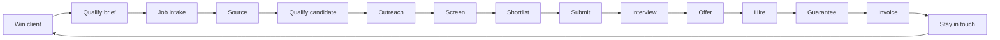

# Business cycle

The agency is small and high-output. We sell **access to suitable candidates**, not CVs.

[← Project overview](README.md) · [Product cycle](product-cycle.md) · [العربية](../ar/business-cycle.md)

## The loop

| Step | What happens |
|---|---|
| 1. Client acquisition | Find the company and start a relationship |
| 2. Client qualification | Company, role, salary, urgency, fee terms |
| 3. Job intake | Turn the need into a job: skills, seniority, location, salary, must-have / nice-to-have |
| 4. Sourcing | LinkedIn Recruiter, referrals, boards, database, communities |
| 5. Candidate qualification | CV / LinkedIn, experience, availability, salary, location, motivation |
| 6. Outreach | Personal message and a follow-up rhythm |
| 7. Screening | Short call and basic questions |
| 8. Shortlist | Best people with a reason and a score |
| 9. Client submission | Send the shortlist |
| 10. Interview management | Book loops and write feedback |
| 11. Offer | Track the offer, negotiate, coordinate |
| 12. Placement | Hired |
| 13. Guarantee / replacement | Watch the guarantee window if the contract has one |
| 14. Invoice and revenue | Fee, invoice, payment, commission |
| 15. Relationship | Come back to the client and the candidate for the next brief |

## Pipeline stages

**Sourced → Contacted → Interested → Screening → Qualified → Submitted → Interview → Offer → Hired**

Side states: **Rejected**, **Withdrawn**, **On hold**.

The kanban on `/pipeline` is this path. Dragging a card is a mock stage change.

## Operating rules

- No candidate without a source, contact details, and a clear status
- No job without a client and clear requirements
- Every important touch goes on the activity timeline
- A candidate can sit on more than one job
- A job can hold several candidates
- AI recommends. Humans decide. We never hire on a score alone
- Build order: manual / static → API → integrations → automation

## KPIs on the desk

Open jobs, active candidates, interviews, offers, hires, jobs sent to seekers, replies waiting, guarantee window, revenue, outstanding fees.

The dashboard shows the operating slice: what is open, what is stuck, who has too much work, which jobs were sent, and which invoices are overdue.

Sourcing and Send jobs are the Recruiter-like half of the product. Pipeline and Commissions are the close-and-collect half. Outreach in this phase is logged only — it does not hit a real mailbox or LinkedIn.
