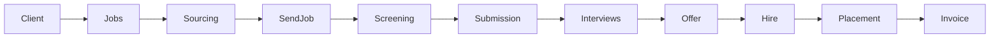

# Product cycle

One dashboard should run the agency without extra process.

[← Project overview](README.md) · [Business cycle](business-cycle.md) · [العربية](../ar/product-cycle.md)

## How records connect

Candidate ↔ Job is **many-to-many**. A person can be live on two briefs; a brief can hold a full pipeline.

## Modules

| Module | In this build | Notes |
|---|---|---|
| Dashboard | Yes | KPIs including jobs sent, guarantee, commission due |
| Jobs | Yes | Search, filters, create, pause, close, duplicate, suggested talent |
| Candidates | Yes | Profile, ranked open jobs, send a brief, notes |
| Clients | Yes | Contacts, jobs, fees, placements |
| Sourcing | Yes | Filter the talent pool against a client job |
| Send jobs | Yes | Mock email / LinkedIn outreach + reply status |
| Commissions | Yes | Fee, recruiter share, invoice collect, guarantee |
| Pipeline | Yes | Kanban; Hired creates placement + invoice |
| Interviews | Yes | Upcoming / past, feedback |
| Activities | Yes | Unified timeline |
| Tasks | Yes | Due date, owner, related records |
| Reports | Yes | Operating charts + recruiter commission |
| Users and roles | Yes | Permission-based; admin can change role and activation |
| Settings | Yes | Workspace; writes are admin-only |
| Documents / CVs | Later | Summary text only in phase 1 |

## Record shapes

**Job** — title, client, description, must-have / nice-to-have, seniority, salary, location, work mode, priority, status, owner, dates.

**Candidate** — identity, contact, LinkedIn, CV summary, skills, experience, salary expectation, availability, source, owner, tags, notes.

**Client** — company, contacts, industry, website, location, fee / agreement, jobs, notes, activity.

**Activity** — email, LinkedIn, call, note, interview, task, status change.

**Opportunity** — a job sent to a seeker: channel, subject, body, sent / replied / declined.

**Placement** — a hire: salary, client fee %, fee amount, recruiter share (40%), invoice, guarantee dates.

## AI layer (intent)

Mock match scores exist on pipeline rows today. Later the same surface can take real model output:

- Parse job descriptions and CVs
- Match score, matched skills, missing skills, explanation
- Screening questions, outreach draft, summaries
- Suggested next action

AI output stays a **recommendation**, never an automatic hire.

## Auth and roles

Access is **permission-first**. A role is a named bundle (`jobs:create`, `users:edit`, …). Route guards and buttons call `can(resource, action)`.

- **Admin** — everything, including users, settings writes, and collecting fees
- **Recruiter** — source, send jobs, run pipeline; view commissions
- **Manager** — team visibility, reports, mark invoices paid
- **Viewer** — read the desk and placements; no reports, no writes

## Roadmap

| Phase | Scope |
|---|---|
| MVP (this repo) | Two-sided desk: source talent, send jobs, pipeline, auto-commission on hire, mock auth |
| API | Laravel, real login, persist the same types |
| Files and AI | CV upload, live match, outreach drafts |
| Integrations | Official LinkedIn / Recruiter where allowed, Gmail, calendar, job boards, n8n |

Do **not** build scraping or automated LinkedIn behaviour as the core of the system.
